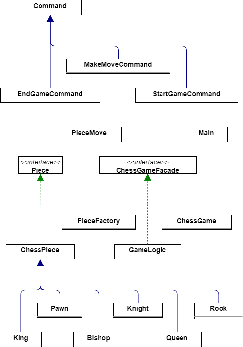

# JavaChess
## JavaChess with Tim and Drico

In this project Tim and I have created a chess game that outputs the move to the console in the JAVA language.
We decided that a chess game would be appropriate since it is a cool game to play and we know how it works.
How we worked:
We have seperatly thought of solutions and projects we can do, this was before we decided on the chess game.
After a day we came together to discuss and compare our finding and find a good solution, which was a chess game.
then we used the idea that we had and searched for more on the internet and

## Class Diagram overview of the project.

## The Factory Design Pattern
In our chess game Tim worked on implementing this design pattern through the 'Piece Factory' class. This class builds the pieces from the Piece classes and creates different chess pieces.
Every method is responsible for creating an instance of a specific chess piece. Each method needs a symbol parameter to initialize the chess piece with the appropriate symbol. For example
The pawn piece is created through the createPawn method and gets an input of P to indicate the chess piece.

The Factory is called in the ChessGame file and uses the factory methods to initialize the chess game.

## Strategy Design Pattern
Tim continued to work on writing the logic of the chess pieces and used a Strategy design pattern to define the family of classes that all use the Piece.java interface. This interface acts
as the strategy interface, and concrete chess pieces classes (e.g., 'Pawn Rook','Rook', etc.) implementing this interface with their specific behaviours. The Piece interface defines two methods, isValidMove and getSymbol represent the common behaviors expected from all chess pieces.

The ChessPiece class is a common class and serves as a context for all chess pieces.